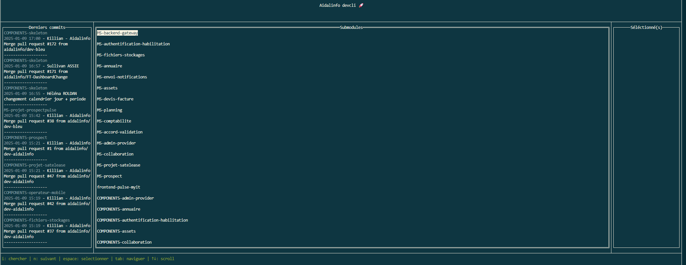
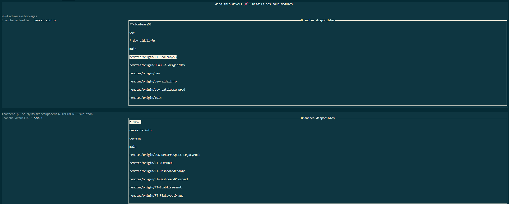
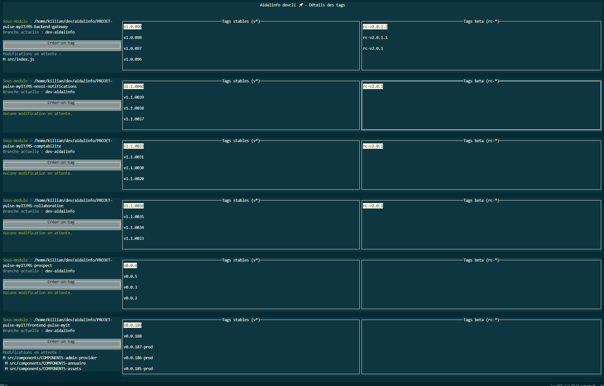

# Aidalinfo devcli

Aidalinfo devcli est une application CLI pour faciliter la vie des développeurs de Aidalinfo.

## Installation

### Linux

```bash
wget https://github.com/aidalinfo/aidalinfo-devcli/releases/latest/download/aidalinfo-cli_linux_amd64 -O aidalinfo-cli
chmod +x aidalinfo-cli
sudo mv aidalinfo-cli /usr/local/bin/
```
Ensuite il faut redémarrer son terminal ou :

Pour bash :
```bash
source ~/.bashrc
```

Pour ZSH : 

```bash
source ~/.zshrc
```

### MacOS

#### Intel

```bash
wget https://github.com/aidalinfo/aidalinfo-devcli/releases/latest/download/aidalinfo-cli_darwin_amd64 -O aidalinfo-cli
chmod +x aidalinfo-cli
sudo mv aidalinfo-cli /usr/local/bin/
```

#### ARM

```bash
wget https://github.com/aidalinfo/aidalinfo-devcli/releases/latest/download/aidalinfo-cli_darwin_arm64 -O aidalinfo-cli
chmod +x aidalinfo-cli
sudo mv aidalinfo-cli /usr/local/bin/
```

## Utilisation

Pour afficher l'aide, exécutez :

```bash
aidalinfo-cli
```

Retour attendu :

```
➜  PROJET-pulse-myIT git:(dev-aidalinfo) ✗ aidalinfo-cli
Vérification des mises à jour ...
Vous utilisez la dernière version disponible.
Usage:
  -ui              Lancer l'interface utilisateur
  -ui-devops       Lancer l'interface DevOps (only tags pour le moment)
  -path            Spécifier le chemin du projet
  -install         Installer les submodules
  -branch="X Y"    Spécifier la ou les branches (X avec fallback sur Y)
  -npm             Installer les dépendances npm
  -full            Installation complète (submodules + npm)
  -version, -v     Afficher la version
```

### Installation des submodules (similaire à project.sh)

```bash
aidalinfo-cli -install -branch="dev-3 dev-aidalinfo" -npm
```

Pour l'instant il est conseillé de spécifier les branches explicitement, si aucune des deux branches n'est disponibles, il utilisera la branche par défaut de GitHub.

### Installation des dépendances npm

```bash
aidalinfo-cli -npm
```

### Gestion des branches

Avec cet outil, il est possible de merge des branches sur la votre actuelle. Vous pouvez donc récupérer le travail des autres développeurs facilement et sur plusieurs submodules depuis la même interface.

Si vous êtes dans le répertoire du projet il suffit de faire la commande suivante : 
(Il est possible de spécifier le path du projet en utilisant l'option -path)

```bash
aidalinfo-cli -ui
```



Une fois dans cette interface, avec tab vous pouvez naviguer entre la liste des subdmodules ou l'historique des commits.

Pour sélectionner des submodules afin d'effectuer des merges, il suffit de le sélectionner avec la touche espace ou entrer. 

Vous verrez les submodules sélectionnés à droite, pour passer à la suite il faut appuyer sur la touche n (next).
Un petit temps de chargement peut s'ajouter en fonction du nombre de submodules sélectionnés.

Une fois sur cette interface :



Vous voyez votre branche actuelle (à gauche) et les branches disponibles (à droite).
Il suffit de sélectionner une branche et de cliquer sur espace ou entrer, l'outil vous demandera de confirmer le merge en vous donnant le résumé des différences.

Pour naviguer sur un autre submodule, il suffit de cliquer sur la touche tab.

### Gestion des tags

Les tags peuvent être créés à partir de la cli aussi.

Il suffit de lancer l'interface DevOps avec l'option -ui-devops.

```bash	
aidalinfo-cli -ui-devops
```



Vous pouvez créer un tag avec le bouton "Créer un tag" qui est associé pour chaque submodule.
Un formulaire vous permet de saisir la version du tag et le message associé. (le tag sera push directement après la création)
